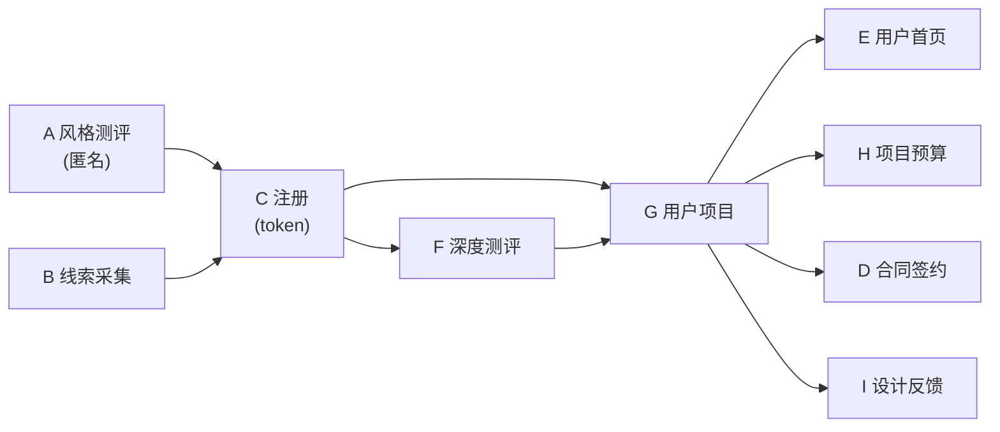

# 数据文档总览与拓扑（按阶段）

> 适用仓库：`ai-studio-xmxq`  
> 文档目标：按**业务阶段**拆成独立文档，每阶段单独成文，**按逻辑拓扑顺序**组织，便于逐步实现/对接后端。  
> 对齐标准：以 `dsphr_workspace` 的接口与约定为“事实标准”（见 `dsphr_workspace/README.md`）。

**小白说明**：系统分为 **9 个阶段**（A–I），从 01 到 09 按顺序阅读即可理解“先做谁、后做谁”。术语人话解释见《03 注册》中的术语表。

---

## 0.1 阶段列表（本次拆分）

| 阶段 | 名称 | 文档 | 说明 |
|------|------|------|------|
| A | 风格测评 | `01-style-eval.md` | 匿名风格测评、结果绑定到账号 |
| B | 线索采集 | `02-leads-collection.md` | 用户填写的意向信息（姓名、城市、项目、面积、预算等），不称“注册” |
| C | 注册 | `03-register.md` | 短信验证码登录/注册、token、鉴权 |
| D | 合同签约 | `04-contracts.md` | 合同版本、签署状态、签名资源 |
| E | 用户首页 | `05-user-home.md` | 工作台首页、导航、待办入口 |
| F | 深度测评 | `06-deep-eval.md` | 深度需求测评、需求书字段来源与映射 |
| G | 用户项目 | `07-projects.md` | 项目聚合根、列表/详情、project_id 生命周期 |
| H | 项目预算 | `08-budget.md` | 预算方案、预算确认、桑基图数据、订单 |
| I | 设计反馈 | `09-design-feedback.md` | 版本、页面、批注/评论、资源 |

**两条用户旅程**：
- **无需登录**：先做 **风格测评（A）**，拿到测评结果。
- **需要登录**：**线索采集（B）** → **注册（C）** 拿到 token → **深度测评（F）** 提交需求 → 有 **项目（G）** 后，**用户首页（E）**、**预算（H）**、**合同（D）**、**设计反馈（I）** 均挂在该项目下。

---

## 0.2 统一约定（必须全模块一致）

### 0.2.1 API Base 与路径前缀（对齐 dsphr_workspace）

- **前端配置**：由 `VITE_API_BASE_URL` 提供（Vite env）。
- **服务端约定**：预算类接口前缀 `/api/dsphr/v1`；登录形态 `POST /api/dsphr/auth/login` 获取 JWT，后续请求携带 `Authorization: Bearer <token>`。

### 0.2.2 鉴权（token）约定

- **放置位置**：HTTP Header `Authorization: Bearer <token>`
- **来源**：`03-register.md` 定义的登录/注册流程返回

### 0.2.3 env 五件套（对齐 dsphr_workspace）

- `.env.local`：本地敏感信息，不提交 git
- `.env.development / .env.test / .env.production`：非敏感配置，可提交
- `.env.example`：只放变量名与说明，不放敏感值
- **加载顺序**：先加载 `.env.{环境}`，再叠加 `.env.local` 覆盖

---

## 0.3 拓扑结构（阶段先后顺序）

### 0.3.1 拓扑说明

- **风格测评（A）**：匿名即可完成，结果可稍后绑定到用户（见 `01-style-eval.md`）。
- **线索采集（B）**：用户填写的意向信息，与 **注册（C）** 配合（先/同时提交均可，见各文档）。
- **注册（C）**：拿到 token 后才有“当前用户”。
- **深度测评（F）**：登录后提交，形成需求数据，用于需求书；与线索采集（B）区分，B 是“意向信息”，F 是“深度需求问卷”。
- **用户项目（G）**：依赖登录与（可选）线索转化；拿到 `project_id` 后，首页（E）、预算（H）、合同（D）、设计反馈（I）均挂在该项目下。

---

## 0.4 跨模块核心 ID 与数据关系

### 0.4.1 核心 ID（统一命名建议）

- `user_id`：用户主键（后端生成）
- `access_token`：用户登录 token（JWT）
- `lead_id`：线索主键（后端生成）
- `project_id`：项目主键（后端生成）
- `contract_id`：合同主键（后端生成）
- `budget_plan_id`：预算方案版本主键（后端生成）
- `design_version_id`：设计稿版本主键（后端生成）
- `comment_id` / `annotation_id`：评论/批注主键（后端生成）
- `style_profile_id`：风格画像记录主键（后端生成）
- `style_eval_session_id`：匿名风格测评会话 ID（前端或后端生成）

### 0.4.2 关系（后端视角）

- 一个 `user` 可有多个 `project`
- 一个 `lead` 可转化为一个 `project`（默认 1:1）
- 一个 `project` 下可有：`budget_plan`、`order`、`contract`、`design_version`、`design_comment`/`design_annotation`，以及（可选）当前生效的 `style_profile`

---

## 0.5 文档阅读顺序建议

- 先看 **00-overview.md**（本文）建立全局。
- 按阶段实现时：**01** → **02** → **03** → … → **09**。
- 需求书与深度测评字段映射在 **06-deep-eval.md**，与需求书展示、工作台取数相关。
